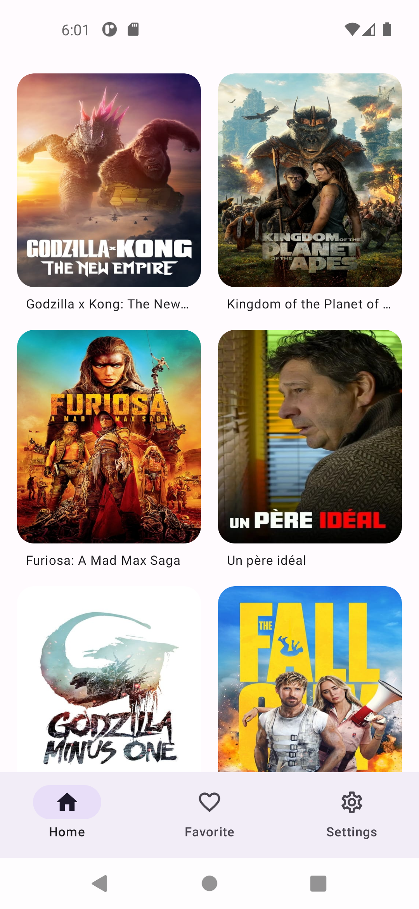
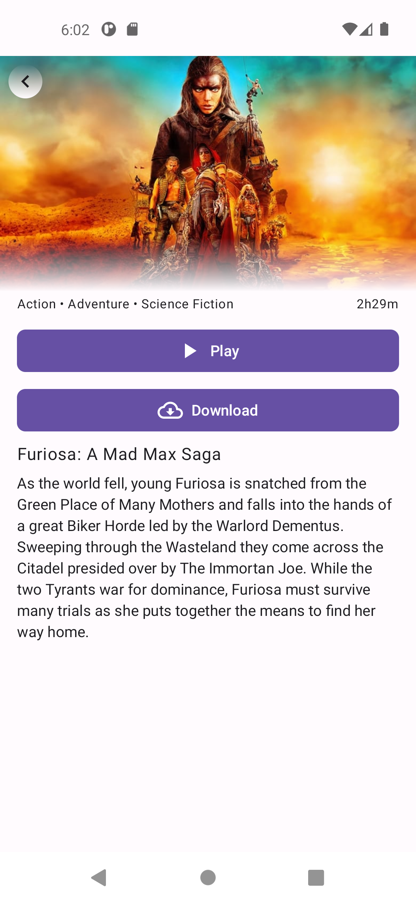
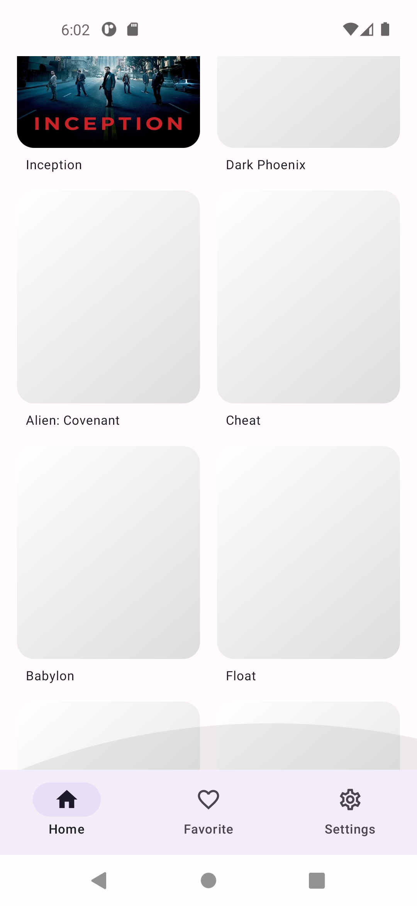
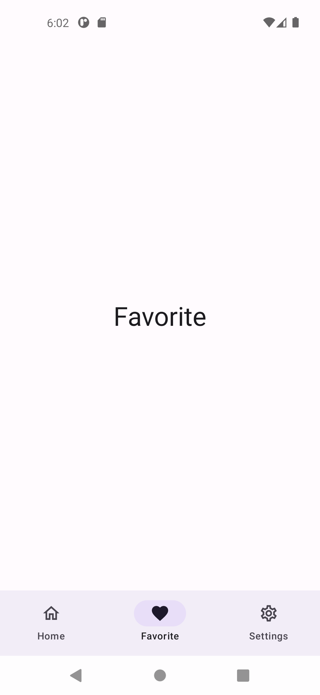

<h1 align="center">Movies App (Demo)</h1> 

Simple movies app intended to showcase my understanding of high quality software, I was given a week (6 days) to complete the task but I was busy working on a client poject,
The developement took less then 10 hours while sleep deprived :)

## Data

[Data from TMDB](https://www.themoviedb.org/)

## Screenshots

    
    
    
    
    

## Android development

Movies App is an app that is using the latest libraries and tools. As a summary:

 * Entirely written in [Kotlin](https://kotlinlang.org/).
 * UI completely written in [Jetpack Compose](https://developer.android.com/jetpack/compose).
 * Uses [Kotlin Coroutines](https://kotlinlang.org/docs/reference/coroutines/coroutines-guide.html) throughout.
 * Uses many of the [Architecture Components](https://developer.android.com/topic/libraries/architecture/), including:Lifecycle, Navigation.
 * Uses [Hilt](https://dagger.dev/hilt/) for dependency injection
 * Uses [Ktor](https://ktor.io/docs/getting-started-ktor-client.html) for network.
 * Single module.
